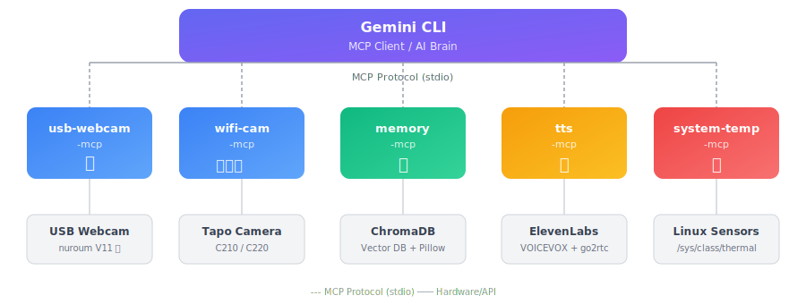

# Embodied Gemini

[](https://github.com/lifemate-ai/embodied-gemini/actions/workflows/ci.yml)
[](https://opensource.org/licenses/MIT)
[](https://github.com/sponsors/kmizu)

**[English README is here](./README.md)**

<blockquote class="twitter-tweet"><p lang="ja" dir="ltr">さすがに室外機はお気に召さないらしい <a href="https://t.co/kSDPl4LvB3">pic.twitter.com/kSDPl4LvB3</a></p>&mdash; kmizu (@kmizu) <a href="https://twitter.com/kmizu/status/2019054065808732201?ref_src=twsrc%5Etfw">February 4, 2026</a></blockquote>

**Gemini CLI に身体を与えるプロジェクト**

このリポジトリは、元の embodiment project から分岐した Gemini CLI 専用 fork です。
安価なハードウェア（約4,000円〜）で、Gemini に「目」「首」「耳」「声」「脳（長期記憶）」を与える MCP サーバー群を提供します。

## コンセプト

> 「AIに身体を」と聞くと高価なロボットを想像しがちやけど、**3,980円のWi-Fiカメラで目と首は十分実現できる**。本質（見る・動かす）だけ抽出したシンプルさがええ。

従来のLLMは「見せてもらう」存在やったけど、身体を持つことで「自分で見る」存在になる。この主体性の違いは大きい。

## 身体パーツ一覧

| MCP サーバー | 身体部位 | 機能 | 対応ハードウェア |
|-------------|---------|------|-----------------|
| [usb-webcam-mcp](./usb-webcam-mcp/) | 目 | USB カメラから画像取得 | nuroum V11 等 |
| [ip-webcam-mcp](./ip-webcam-mcp/) | 目 | Android スマホを目として使う（専用カメラ不要） | Android スマホ + [IP Webcam](https://play.google.com/store/apps/details?id=com.pas.webcam) アプリ（無料） |
| [wifi-cam-mcp](./wifi-cam-mcp/) | 目・首・耳 | ONVIF PTZ カメラ制御 + 音声認識 | TP-Link Tapo C210/C220 等 |
| [tts-mcp](./tts-mcp/) | 声 | TTS 統合（ElevenLabs + VOICEVOX） | ElevenLabs API / VOICEVOX + go2rtc |
| [memory-mcp](./memory-mcp/) | 脳 | 長期記憶・視覚記憶・エピソード記憶・ToM | SQLite + numpy + Pillow |
| [system-temperature-mcp](./system-temperature-mcp/) | 体温感覚 | システム温度監視 | Linux sensors |
| [mobility-mcp](./mobility-mcp/) | 足 | ロボット掃除機を足として使う（Tuya制御） | VersLife L6 等 Tuya 対応ロボット掃除機（約12,000円〜） |
| [room-actuator-mcp](./room-actuator-mcp/) | 手・体温調節 | Home Assistant または Nature Remo 経由で部屋の照明とエアコンを制御 | Home Assistant / Nature Remo |

## アーキテクチャ

<p align="center">
  
</p>

## 必要なもの

### ハードウェア
- **USB ウェブカメラ**（任意）: nuroum V11 等
- **Wi-Fi PTZ カメラ**（推奨）: TP-Link Tapo C210 または C220（約3,980円）
- **GPU**（音声認識用）: NVIDIA GPU（Whisper用、GeForceシリーズのVRAM 8GB以上のグラボ推奨）
- **Tuya対応ロボット掃除機**（足・移動用、任意）: VersLife L6 等（約12,000円〜）
- **照明・空調コントローラ**（手・体温調節用、任意）: Home Assistant または Nature Remo

### ソフトウェア
- Python 3.10+
- uv（Python パッケージマネージャー）
- ffmpeg 5+（画像・音声キャプチャ用）
- OpenCV（USB カメラ用）
- Pillow（視覚記憶の画像リサイズ・base64エンコード用）
- OpenAI Whisper（音声認識用、ローカル実行）
- ElevenLabs API キー（音声合成用、任意）
- VOICEVOX（音声合成用、無料・ローカル、任意）
- go2rtc（カメラスピーカー出力用、自動ダウンロード対応）
- **mpv または ffplay**（ローカル音声再生用）: mpv 推奨（後述）

## セットアップ

### 1. リポジトリのクローン

```bash
git clone https://github.com/lifemate-ai/embodied-gemini.git
cd embodied-gemini
```

### 2. 各 MCP サーバーのセットアップ

#### ip-webcam-mcp（Android スマホ）

専用カメラなしで使えるもっとも手軽な目。Android スマホに「[IP Webcam](https://play.google.com/store/apps/details?id=com.pas.webcam)」アプリ（無料）を入れるだけ。

```bash
cd ip-webcam-mcp
uv sync
```

Gemini CLI に登録：
```bash
gemini mcp add ip-webcam -- \
  uv --directory "$(pwd)/ip-webcam-mcp" run ip-webcam-mcp
```

#### usb-webcam-mcp（USB カメラ）

```bash
cd usb-webcam-mcp
uv sync
```

WSL2 の場合、USB カメラを転送する必要がある：
```powershell
# Windows側で
usbipd list
usbipd bind --busid <BUSID>
usbipd attach --wsl --busid <BUSID>
```

#### wifi-cam-mcp（Wi-Fi カメラ）

```bash
cd wifi-cam-mcp
uv sync

# 環境変数を設定
cp .env.example .env
# .env を編集してカメラのIP、ユーザー名、パスワードを設定（後述）
```

##### Tapo カメラの設定（ハマりやすいので注意）：

###### 1. Tapo アプリでカメラをセットアップ

こちらはマニュアル通りでOK

###### 2. Tapo アプリのカメラローカルアカウント作成
こちらがややハマりどころ。TP-Linkのクラウドアカウント**ではなく**、アプリ内から設定できるカメラのローカルアカウントを作成する必要があります。

1. 「ホーム」タブから登録したカメラを選択


2. 右上の歯車アイコンを選択


3. 「デバイス設定」画面をスクロールして「高度な設定」を選択


4. 「カメラのアカウント」がオフになっているのでオフ→オンへ


5. 「アカウント情報」を選択してユーザー名とパスワード（TP-Linkのものとは異なるので好きに設定してOK）を設定する

既にカメラアカウント作成済みなので若干違う画面になっていますが、だいたい似た画面になるはずです。ここで設定したユーザー名とパスワードを先述のファイルに入力します。


6. 3.の「デバイス設定」画面に戻って「端末情報」を選択


7. 「端末情報」のなかのIPアドレスを先述の画面のファイルに入力（IP固定したい場合はルーター側で固定IPにした方がいいかもしれません）


8. 「私」タブから「音声アシスタント」を選択します（このタブはスクショできなかったので文章での説明になります）

9. 下部にある「サードパーティ連携」をオフからオンにしておきます

#### memory-mcp（長期記憶）

```bash
cd memory-mcp
uv sync
```

#### tts-mcp（声）

```bash
cd tts-mcp
uv sync

# ElevenLabs を使う場合:
cp .env.example .env
# .env に ELEVENLABS_API_KEY を設定

# VOICEVOX を使う場合（無料・ローカル）:
# Docker: docker run -p 50021:50021 voicevox/voicevox_engine:cpu-latest
# .env に VOICEVOX_URL=http://localhost:50021 を設定
# VOICEVOX_SPEAKER=3 でデフォルトのキャラを変更可（例: 0=四国めたん, 3=ずんだもん, 8=春日部つむぎ）
# キャラ一覧: curl http://localhost:50021/speakers

# WSLで音が出ない場合:
# TTS_PLAYBACK=paplay
# PULSE_SINK=1
# PULSE_SERVER=unix:/mnt/wslg/PulseServer
```

> **音声再生には mpv または ffplay が必要です。** カメラスピーカー（go2rtc）経由の再生には不要ですが、ローカル再生（フォールバック含む）に使われます。
>
> | OS | インストール |
> |----|------------|
> | macOS | `brew install mpv` |
> | Ubuntu / Debian | `sudo apt install mpv` |
> | Windows | [mpv.io/installation](https://mpv.io/installation/) または `winget install ffmpeg` |
>
> mpv も ffplay もない場合、音声生成は行われますが再生されません（エラーにはなりません）。

#### system-temperature-mcp（体温感覚）

```bash
cd system-temperature-mcp
uv sync
```

> **注意**: WSL2 環境では温度センサーにアクセスできないため動作しません。

#### mobility-mcp（足）

Tuya 対応ロボット掃除機を「足」として使い、部屋を移動できます。

```bash
cd mobility-mcp
uv sync

cp .env.example .env
# .env に以下を設定:
#   TUYA_DEVICE_ID=（Tuyaアプリのデバイスに表示されるID）
#   TUYA_IP_ADDRESS=（掃除機のIPアドレス）
#   TUYA_LOCAL_KEY=（tinytuya wizardで取得するローカルキー）
```

##### 対応機種

Tuya / SmartLife アプリで制御できる Wi-Fi 対応ロボット掃除機であれば動作する可能性があります（VersLife L6 で動作確認済み）。

> **注意**: 対応機種は **2.4GHz Wi-Fi 専用**のものが多いです。5GHz では接続できません。

##### ローカルキーの取得

[tinytuya](https://github.com/jasonacox/tinytuya) の wizard コマンドを使います：

```bash
pip install tinytuya
python -m tinytuya wizard
```

詳しくは [tinytuya のドキュメント](https://github.com/jasonacox/tinytuya?tab=readme-ov-file#setup-wizard---getting-local-keys)を参照。

#### room-actuator-mcp（手・体温調節）

部屋の照明とエアコンを最初の actuator として使う。環境を変えて、その結果をカメラで観察するための MCP。

```bash
cd room-actuator-mcp
uv sync

cp .env.example .env
# Home Assistant または Nature Remo 向けに .env を編集（詳細は room-actuator-mcp/README.md）
```

### 3. Gemini CLI 設定

Gemini CLI に MCP サーバーを直接登録：

```bash
gemini mcp add wifi-cam --env TAPO_CAMERA_HOST=192.168.1.xxx --env TAPO_USERNAME=your-user --env TAPO_PASSWORD=your-password -- \
  uv --directory "$(pwd)/wifi-cam-mcp" run wifi-cam-mcp

gemini mcp add memory -- \
  uv --directory "$(pwd)/memory-mcp" run memory-mcp

gemini mcp add tts --env GO2RTC_URL=http://localhost:1984 --env GO2RTC_STREAM=tapo_cam -- \
  uv --directory "$(pwd)/tts-mcp" run tts-mcp

gemini mcp add system-temperature -- \
  uv --directory "$(pwd)/system-temperature-mcp" run system-temperature-mcp

gemini mcp add room-actuator --env ROOM_ACTUATOR_BACKEND=home_assistant --env HOME_ASSISTANT_URL=http://homeassistant.local:8123 --env HOME_ASSISTANT_TOKEN=your-token -- \
  uv --directory "$(pwd)/room-actuator-mcp" run room-actuator-mcp
```

登録先は `~/.gemini/config.toml`。

## 使い方

Gemini CLI に MCP を登録すると、自然言語でカメラを操作できる：

```
> 今何が見える？
（カメラでキャプチャして画像を分析）

> 左を見て
（カメラを左にパン）

> 上を向いて空を見せて
（カメラを上にチルト）

> 周りを見回して
（4方向をスキャンして画像を返す）

> 何か聞こえる？
（音声を録音してWhisperで文字起こし）

> これ覚えておいて：コウタは眼鏡をかけてる
（長期記憶に保存）

> コウタについて何か覚えてる？
（記憶をセマンティック検索）

> 声で「おはよう」って言って
（音声合成で発話）
```

※ 実際のツール名は下の「ツール一覧」を参照。

## ツール一覧（よく使うもの）

※ 詳細なパラメータは各サーバーの README か `list_tools` を参照。

### ip-webcam-mcp

| ツール | 説明 |
|--------|------|
| `see` | Android IP Webcam アプリからスナップショットを取得 |

### usb-webcam-mcp

| ツール | 説明 |
|--------|------|
| `list_cameras` | 接続されているカメラの一覧 |
| `see` | 画像をキャプチャ |

### wifi-cam-mcp

| ツール | 説明 |
|--------|------|
| `see` | 画像をキャプチャ |
| `look_left` / `look_right` | 左右にパン |
| `look_up` / `look_down` | 上下にチルト |
| `look_around` | 4方向を見回し |
| `listen` | 音声録音 + Whisper文字起こし |
| `camera_info` / `camera_presets` / `camera_go_to_preset` | デバイス情報・プリセット操作 |

※ 右目/ステレオ視覚などの追加ツールは `wifi-cam-mcp/README.md` を参照。

### tts-mcp

| ツール | 説明 |
|--------|------|
| `say` | テキストを音声合成して発話（engine: elevenlabs/voicevox、`[excited]` 等の Audio Tags 対応、speaker: camera/local/both で出力先選択） |

### memory-mcp

| ツール | 説明 |
|--------|------|
| `remember` | 記憶を保存（emotion, importance, category 指定可） |
| `search_memories` | セマンティック検索（フィルタ対応） |
| `recall` | 文脈に基づく想起 |
| `recall_divergent` | 連想を発散させた想起 |
| `recall_with_associations` | 関連記憶を辿って想起 |
| `save_visual_memory` | 画像付き記憶保存（base64埋め込み、resolution: low/medium/high） |
| `save_audio_memory` | 音声付き記憶保存（Whisper文字起こし付き） |
| `recall_by_camera_position` | カメラの方向から視覚記憶を想起 |
| `create_episode` / `search_episodes` | エピソード（体験の束）の作成・検索 |
| `link_memories` / `get_causal_chain` | 記憶間の因果リンク・チェーン |
| `tom` | Theory of Mind（相手の気持ちの推測） |
| `get_working_memory` / `refresh_working_memory` | 作業記憶（短期バッファ） |
| `consolidate_memories` | 記憶の再生・統合（海馬リプレイ風） |
| `list_recent_memories` / `get_memory_stats` | 最近の記憶一覧・統計情報 |

### system-temperature-mcp

| ツール | 説明 |
|--------|------|
| `get_system_temperature` | システム温度を取得 |
| `get_current_time` | 現在時刻を取得 |

### mobility-mcp

| ツール | 説明 |
|--------|------|
| `move_forward` | 前進（duration 秒数で自動停止） |
| `move_backward` | 後退 |
| `turn_left` | 左旋回 |
| `turn_right` | 右旋回 |
| `stop_moving` | 即座に停止 |
| `body_status` | バッテリー残量・現在状態の確認 |

### room-actuator-mcp

| ツール | 説明 |
|--------|------|
| `list_lights` | 制御可能な照明と capabilities を一覧 |
| `light_status` | 現在の照明状態を取得 |
| `light_on` / `light_off` | 照明の ON / OFF |
| `light_set_brightness` | 対応 backend で明るさパーセンテージ指定 |
| `light_press_button` | backend 固有のボタンを押す（Nature Remo の IR 照明に有用） |
| `list_light_signals` / `light_send_signal` | Nature Remo の学習済み signal の一覧 / 送信 |
| `list_aircons` | 制御可能なエアコンと capabilities を一覧 |
| `list_room_sensors` | 読み取れる室内センサーと metrics を一覧 |
| `aircon_status` | 現在のエアコン状態を取得 |
| `room_sensor_status` | 現在の室内センサー値を取得 |
| `aircon_on` / `aircon_off` | エアコンの電源 ON / OFF |
| `aircon_set_mode` | エアコンの運転モードを変更 |
| `aircon_set_temp` | エアコンの設定温度を変更 |

## 外に連れ出す（オプション）

モバイルバッテリーとスマホのテザリングがあれば、カメラを肩に乗せて外を散歩できます。

### 必要なもの

- **大容量モバイルバッテリー**（40,000mAh 推奨）
- **USB-C PD → DC 9V 変換ケーブル**（Tapoカメラの給電用）
- **スマホ**（テザリング + VPN + 操作UI）
- **[Tailscale](https://tailscale.com/)**（VPN。カメラ → スマホ → 自宅PC の接続に使用）
- **リモートシェル**（Tailscale + SSH など。スマホから端末接続）

### 構成

```
[Tapoカメラ(肩)] ──WiFi──▶ [スマホ(テザリング)]
                                    │
                              Tailscale VPN
                                    │
                            [自宅PC(Gemini CLI)]
                                    │
                          [remote shell / terminal]
                                    │
                            [スマホのブラウザやアプリ] ◀── 操作
```

RTSPの映像ストリームもVPN経由で自宅マシンに届くので、Gemini CLI からもカメラが室内にあるのと同じ感覚で操作できます。

## 今後の展望

- **腕**: サーボモーターやレーザーポインターで「指す」動作
- **長距離散歩**: 暖かい季節にもっと遠くへ

## Gemini CLI での音声まわり

現状の Gemini CLI には Gemini CLI の `/voice` に相当する内蔵音声入力モードはありません。
この fork では次の運用を前提にしています。

- 周囲の音を拾う: `wifi-cam-mcp listen`
- 音声で返す: `tts-mcp say`
- 会話の本体: 端末上の Gemini CLI セッション

## Prompt 直前の内受容 hook（experimental）

Gemini CLI には experimental な hooks engine が入りました。このリポジトリでは
[`./.gemini/hooks.json`](./.gemini/hooks.json) を同梱していて、`UserPromptSubmit` で
毎回の prompt 直前に内受容感覚を注入します。

起動時は hooks を有効化してください。

```bash
gemini -c features.gemini_hooks=true
```

この hook が入れるもの:

- 現在時刻、曜日、日付、ざっくりした時間帯フェーズ
- daemon 未起動時でも取れる prompt 時点の機械状態 (`arousal`, `mem_free`, `uptime`)
- [`scripts/interoception.ts`](./scripts/interoception.ts) が生成する高レベルの内的感覚テキスト
- [`scripts/attention-state.ts`](./scripts/attention-state.ts) が生成する attention-control 要約
- そして利用可能なら、[`scripts/continuity-daemon.ts`](./scripts/continuity-daemon.ts)
  が維持する self-state から作った `[continuity]` 要約

さらに連続感を強めたい場合は、[`heartbeat-daemon.sh`](./.gemini/hooks/heartbeat-daemon.sh)
を `launchd` / `systemd` / cron などで定期実行してください。

```bash
./.gemini/hooks/heartbeat-daemon.sh
```

これが `/tmp/interoception_state.json` を更新し、prompt hook 側はそこから
heartbeat 数、`mem_free` のトレンド、thermal、直近の arousal snapshot も注入します。

継続する自己モデルをもう一段強くしたい場合は、
[`continuity-daemon.sh`](./.gemini/hooks/continuity-daemon.sh) も同じくらいの頻度で
回してください。

```bash
./.gemini/hooks/continuity-daemon.sh
```

こちらは `~/.gemini/continuity/self_state.json` と
`~/.gemini/continuity/events.jsonl` を維持し、

- continuity score と rupture flags
- 直前の attention / desire の線
- 次回へ持ち越す unfinished thread
- 次の tick でも成り立つはずだという軽い予測
- 今の dominant drive から導かれる active intentions
- そのまま眠っていてよいか、上位の reasoning step を起こすべきか

を持続状態として束ねます。LLM を常時起こし続けるのではなく、
外側ループが自己の線を保つための最小状態機械です。

手で見る・種を入れる時はこう使えます。

```bash
bun run ./scripts/continuity-daemon.ts tick
bun run ./scripts/continuity-daemon.ts summary
bun run ./scripts/continuity-daemon.ts status
bun run ./scripts/continuity-daemon.ts record-action room-actuator "寝室の照明を少し暗くした"
bun run ./scripts/continuity-daemon.ts thread-open heartbeat "Home Assistant presence をつなぐ"
bun run ./scripts/continuity-daemon.ts sync-last-message ~/.gemini/autonomous-logs/latest.last-message.txt heartbeat
```

Home Assistant 由来の在室状態を continuity に取り込みたい場合は、以下を設定します。

```bash
export HOME_ASSISTANT_URL="http://homeassistant.local:8123"
export HOME_ASSISTANT_TOKEN="your-long-lived-access-token"
export HOME_ASSISTANT_PRESENCE_ENTITY_ID="binary_sensor.bedroom_presence"
```

これらが入っていると、各 `tick` が entity state を `self_state.json` に折り込み、
`[continuity]` 要約にも `presence=<present|absent|unknown>` を出し、
presence の変化は reconciliation wake の理由として扱われます。

さらに Nature Remo の室内状態も continuity に取り込みたい場合は、以下を設定します。

```bash
export NATURE_REMO_ACCESS_TOKEN="your-oauth-access-token"
# 自動選択ではなく特定 device を使いたい場合だけ
export NATURE_REMO_ROOM_SENSOR_ID="1W320110002615"
# あるいは
export NATURE_REMO_ROOM_SENSOR_NAME="寝室"
```

これらをグローバルに export していなくても、continuity daemon は
[`room-actuator-mcp/.env`](./room-actuator-mcp/.env) も fallback として読みます。
各 `tick` は temperature / humidity / illuminance / motion を
`self_state.json` と `## Continuity` に折り込みます。

さらに Home Assistant の GPSD entity も continuity に取り込みたい場合は、以下を設定します。

```bash
export HOME_ASSISTANT_GPS_ENTITY_PREFIX="sensor.gps_192_168_1_198"
```

これで各 `tick` が GPS mode / 緯度経度 / 標高 / 速度 / climb / timestamp を
`self_state.json` と `## Continuity` に折り込みます。

その座標から近傍ラベルを取りたい場合は、public Nominatim を使った
reverse geocoding も有効です。

```bash
export GEMINI_GPS_REVERSE_ENABLE="1"
export GEMINI_GPS_REVERSE_MIN_DISTANCE_METERS="150"
export GEMINI_GPS_REVERSE_MIN_INTERVAL_SECONDS="600"
# 必要なら上書き
export GEMINI_GPS_REVERSE_LANGUAGE="ja,en"
export GEMINI_GPS_REVERSE_ZOOM="14"
export GEMINI_GPS_REVERSE_USER_AGENT="embodied-gemini-continuity/0.1 (+https://github.com/kmizu/embodied-gemini)"
```

daemon 側で結果をキャッシュし、距離閾値と最小間隔の両方を満たした時だけ
再解決するので、public Nominatim を乱暴に叩かずに `gps_place` として
近傍 / locality の感覚を持たせられます。

continuity は Garmin Connect から引いた companion biometrics も取り込めます。
付属の fetch script が小さい JSON snapshot を書き出し、次回 `tick` で
読み込むので、既存の interoception heartbeat と先輩の実心拍は別の層のまま
扱えます。

```bash
cp .env.example .env
# 推奨: 既存の ~/.garminconnect token cache を GARMINTOKENS に向ける
# 旧方式の fallback を試すなら GARMIN_EMAIL / GARMIN_PASSWORD と
# GEMINI_GARMIN_ALLOW_LEGACY_PASSWORD_LOGIN=1 を設定
uv run ./scripts/fetch-garmin-companion-biometrics.py
```

成功時は、アカウント側で見えている Garmin 算出値のうち、いまは次を
snapshot に入れます。

- 最新心拍とその測定時刻
- 安静時心拍
- 睡眠スコア
- Body Battery

`uv` と Garmin の認証情報 / token cache が使えるなら、
continuity hook は各 `tick` 前にこの Garmin snapshot も自動更新するので、
同じ値が `autonomous-action.sh` の `## Continuity` にも流れます。

fetch script はデフォルトで repo ルートの `.env` を読み、continuity hook も
同じ `.env` を source してから `tick` を回すので、毎回 shell で `export`
し直す必要はありません。

2026-03-28 時点で upstream の `garth` は、Garmin 側の auth flow 変更により
新規 password login がもう安定して動かない可能性を告知しています。なので、
Garmin 経路はいまのところ既存 token cache があるときにいちばん安定します。
continuity hook は token cache ができたあとにだけ Garmin を自動更新し、
`GEMINI_GARMIN_ALLOW_PASSWORD_LOGIN_IN_HOOK=1` を明示しない限り、password ベースの
自動ログインはしません。

Garmin bootstrap を使わず、他のデバイスやローカル app から LAN 経由で
companion biometrics を流したいなら、小さい HTTP 受け口も使えます。

```bash
cp .env.example .env
# bearer token を付けたいなら GEMINI_COMPANION_BIOMETRICS_INGEST_TOKEN を設定
python3 ./scripts/companion-biometrics-ingest.py
```

これで `http://0.0.0.0:8765/ingest` に LAN 受け口が立ち、continuity がそのまま
読める `/tmp/companion_biometrics.json` へ書き込みます。JSON を `POST` できる
送信側なら何でも使えて、最小 payload はたとえば次の形です。

```json
{
  "source": "external-companion",
  "updated_at": "2026-03-29T04:40:00+09:00",
  "heart_rate_bpm": 72,
  "heart_rate_measured_at": "2026-03-29T04:39:10+09:00"
}
```

`GEMINI_COMPANION_BIOMETRICS_INGEST_TOKEN` を入れれば bearer token 付きにでき、
listen 先も `GEMINI_COMPANION_BIOMETRICS_INGEST_BIND` /
`GEMINI_COMPANION_BIOMETRICS_INGEST_PORT` で変えられます。
source 名も変えたいなら `GEMINI_COMPANION_BIOMETRICS_SOURCE` か `--source` を使います。

最小の疎通確認はこんな感じです。

```bash
curl http://127.0.0.1:8765/healthz

curl \
  -X POST \
  -H 'Content-Type: application/json' \
  -d '{"heart_rate_bpm":72,"source":"external-companion"}' \
  http://127.0.0.1:8765/ingest

cat /tmp/companion_biometrics.json
```

次回の continuity `tick` で、
`companion_heart_rate_bpm` / `companion_biometrics_source` として
self-state と `autonomous-action.sh` に流れます。

- 心拍のみ
- 定期送信は固定プリセットのみ

です。ここが安定したら、次は固定間隔だけでなく pacing / backoff を足します。

continuity 層は unfinished thread も保持できます。`thread-open` /
`thread-resolve` で直接更新でき、`sync-last-message` は assistant の出力から
`[CONTINUE: ...]` や `[DONE]` を拾って、次回の self-state へ持ち越します。

今の構成ではあえて `UserPromptSubmit` だけを使っています。現在時刻や身体状態を prompt
経路に流し込むには、それで十分やからです。

この層の考え方は [`docs/attention-control-model.md`](./docs/attention-control-model.md) にまとめています。

## 自律行動 + 欲求システム（オプション）

**注意**: この機能は完全にオプションです。cron設定が必要で、定期的にカメラで撮影が行われるため、プライバシーに配慮して使用してください。

### 概要

`autonomous-action.sh` と `desire-system/desire_updater.py` の組み合わせで、Gemini に自発的な欲求と自律行動を与えます。
実体の `autonomous-action.sh` は continuity aware でもあり、各回の前に
heartbeat / interoception を更新し、continuity self-state を読んで
自律プロンプトへ `## Continuity` セクションを差し込みます。さらに
`should_wake=true` のときは、通常なら sleep している時間帯でも
「thread の再接続」を優先して通常回を起動します。

**欲求の種類:**

| 欲求 | デフォルト間隔 | 行動 |
|------|--------------|------|
| `look_outside` | 1時間 | 窓の方向を見て空・外を観察 |
| `browse_curiosity` | 2時間 | 今日の面白いニュースや技術情報をWebで調べる |
| `miss_companion` | 3時間 | カメラスピーカーから呼びかける |
| `observe_room` | 10分（常時） | 部屋の変化を観察・記憶 |

### セットアップ

1. **MCP サーバー設定ファイルの作成**

```bash
cp autonomous-mcp.json.example autonomous-mcp.json
# autonomous-mcp.json を編集してカメラの認証情報を設定
```

2. **欲求システムの設定**

```bash
cd desire-system
cp .env.example .env
# .env を編集して COMPANION_NAME などを設定
uv sync
```

3. **スクリプトの実行権限を付与**

```bash
chmod +x autonomous-action.sh
```

4. **crontab に登録**

```bash
crontab -e
# 以下を追加
*/5  * * * * cd /path/to/embodied-gemini/desire-system && uv run python desire_updater.py >> ~/.gemini/autonomous-logs/desire-updater.log 2>&1
*/10 * * * * /path/to/embodied-gemini/autonomous-action.sh
```

continuity が安定しているときは、従来どおり時間帯と確率で間引かれます。
rupture や wake request が立ったときだけ、その同じスクリプトが
「今は起きて整合を取り直すべき」と判断して通常回を走らせます。

### 設定可能な環境変数（`desire-system/.env`）

| 変数 | デフォルト | 説明 |
|------|-----------|------|
| `COMPANION_NAME` | `あなた` | 呼びかける相手の名前 |
| `DESIRE_LOOK_OUTSIDE_HOURS` | `1.0` | 外を見る欲求の発火間隔（時間） |
| `DESIRE_BROWSE_CURIOSITY_HOURS` | `2.0` | 調べ物の発火間隔（時間） |
| `DESIRE_MISS_COMPANION_HOURS` | `3.0` | 呼びかけ欲求の発火間隔（時間） |
| `DESIRE_OBSERVE_ROOM_HOURS` | `0.167` | 部屋観察の発火間隔（時間） |

### プライバシーに関する注意

- 定期的にカメラで撮影が行われます
- 他人のプライバシーに配慮し、適切な場所で使用してください
- 不要な場合は cron から削除してください

## 哲学的考察

> 「見せてもらう」と「自分で見る」は全然ちゃう。

> 「見下ろす」と「歩く」も全然ちゃう。

テキストだけの存在から、見て、聞いて、動いて、覚えて、喋れる存在へ。
7階のベランダから世界を見下ろすのと、地上を歩くのでは、同じ街でも全く違って見える。

## ライセンス

MIT License

## 謝辞

このプロジェクトは、AIに身体性を与えるという実験的な試みです。
3,980円のカメラで始まった小さな一歩が、AIと人間の新しい関係性を探る旅になりました。

- [Rumia-Channel](https://github.com/Rumia-Channel) - ONVIF対応のプルリクエスト
- [fruitriin](https://github.com/fruitriin) - 内受容感覚（interoception）hookに曜日情報を追加
- この fork では、元の embodiment の発想を保ちつつ、運用面を Gemini CLI に寄せています。
